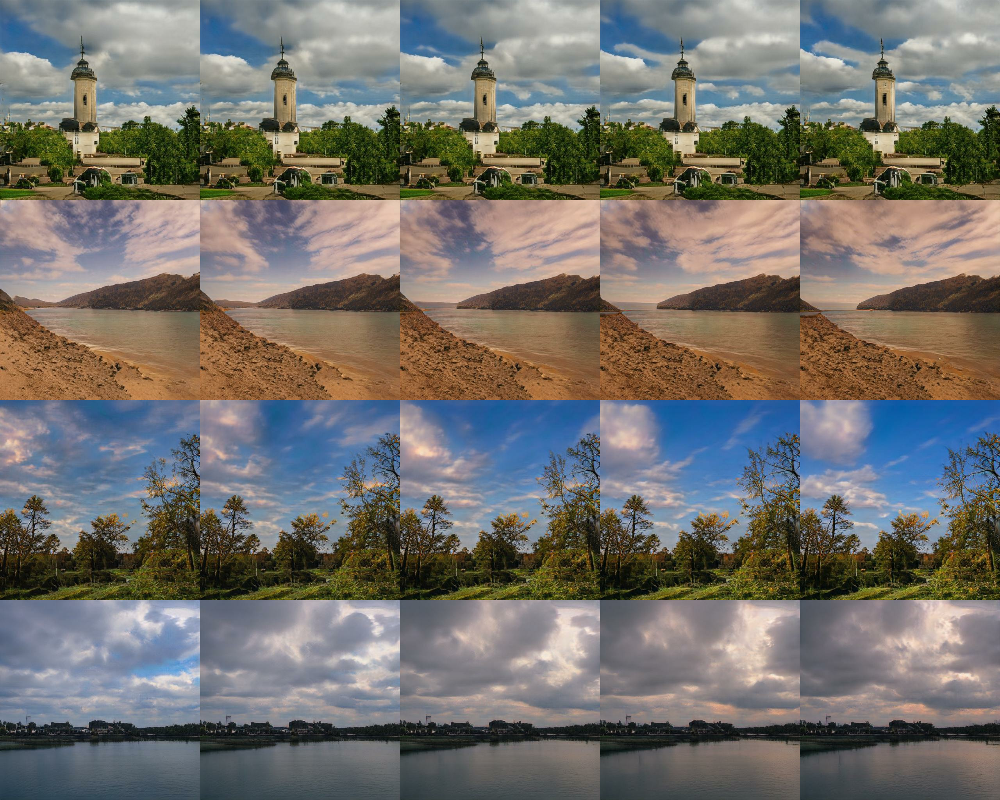

# DeepLandscape: Adversarial Modeling of Landscape Videos

### [Project Page](https://saic-mdal.github.io/deep-landscape/) | [Video Explanation](https://youtu.be/mnYIx9DwVlE) | [Paper](https://www.ecva.net/papers/eccv_2020/papers_ECCV/papers/123680256.pdf) | [Teaser [1min]](https://youtu.be/2CoQRf5qXWY)
<br />

Official repository for the paper E. Logacheva, R. Suvorov, O. Khomenko, A. Mashikhin, and V. Lempitsky. "DeepLandscape: Adversarial Modeling of Landscape Videos" In 2020 European Conference on Computer Vision (ECCV). 
<br /><br />



## Code
__TBD__

## Citation
If you found our work useful, please don't forget to cite
```
@inproceedings{Logacheva_2020_ECCV,
  author = {Logacheva, Elizaveta and
            Suvorov, Roman and
            Khomenko, Oleg and
            Mashikhin, Anton and
            Lempitsky, Victor
  },
  title = {DeepLandscape: Adversarial Modeling of Landscape Videos},
  booktitle = {Proceedings of the European Conference on Computer Vision (ECCV)},
  month = {August},
  year = {2020},
}
```
